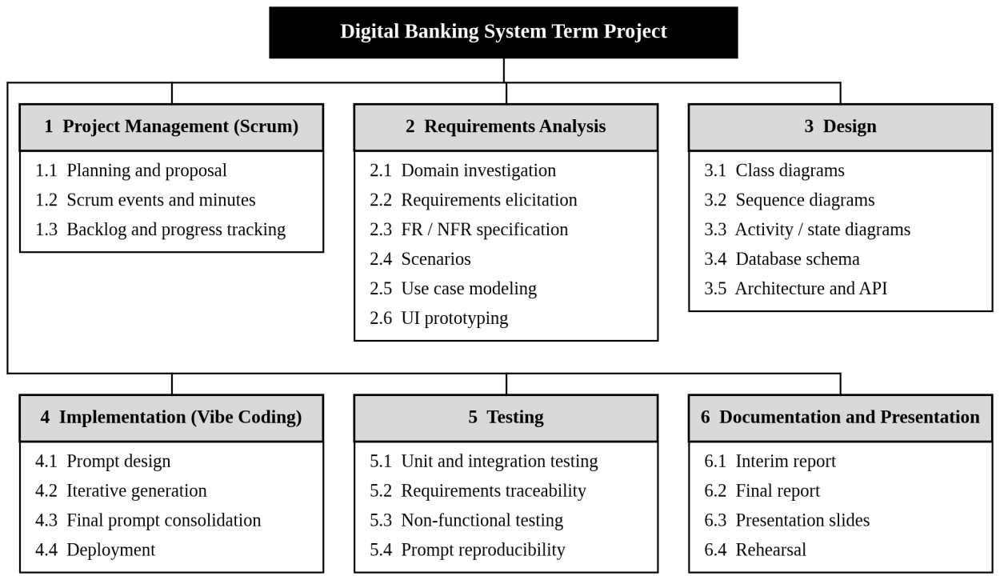
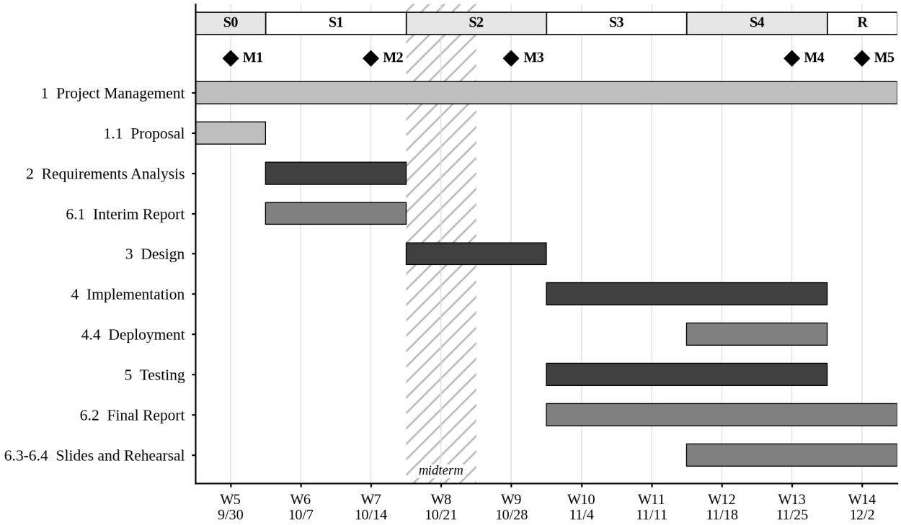

**SOFTWARE ENGINEERING TERM PROJECT** 
Project Proposal

# A Digital Banking System with Delegated Account Access

**Team: Finger Burning Dragon** 
Flora · 26170192 
Jon · 26512006 
Junseop · 22101994

Course 146063-31001, Instructor: Prof. Woo-Je Kim 
Seoul National University of Science and Technology 
September 30, 2026

Project repository: https://github.com/jon-tj/banking-app

> Markdown conversion of the proposal submitted on September 30, 2026 (original: `FBD_Proposal.pdf`). The text is unchanged; only the layout has been adapted to Markdown.

---

## Summary

This proposal describes a web-based digital banking system in which clients manage accounts and move fictitious funds between them. Its distinguishing feature is delegated account access: an account owner can grant other users precisely scoped rights over an account, and every operation records who actually performed it. The system comprises eleven use cases and seven persistent data entities, and it will be developed with the Scrum framework within the fixed milestones of the course, from requirements specification and UML-based design to implementation by AI-assisted vibe coding and deployment as a publicly accessible web application.

## I. Necessity of the Proposed System

Banking is the canonical transaction-processing domain. Every operation that changes a balance must be atomic, must leave the data in a consistent state, and must remain auditable afterwards. Because these requirements are strict yet well understood, a banking system is an ideal subject for experiencing the complete software development life cycle, in which a defect in requirements or design propagates visibly into the delivered system [1], [2].

Beyond its pedagogical value, the system addresses a practical need. Many accounts in daily life are used by several people: the treasury of a student club, a household budget among roommates, or a child’s allowance managed by a parent. Korean banks already serve part of this need with group accounts, as reviewed in Section III-B. In these services, however, shared access is expressed through a small number of fixed roles. A member can typically only view the account, while an owner or co-leader holds full withdrawal and transfer rights. There is no intermediate level, such as allowing an officer to pay only a designated supplier.

A system that lets an owner delegate narrowly scoped rights, records the acting person for every transaction, offers clients a channel to dispute unauthorised operations, and allows administrators to investigate without unrestricted access to personal data therefore goes beyond role-based sharing, while remaining well bounded. It requires no integration with real financial networks, which keeps the scope realistic for a single semester.

## II. Goal of the Project

The overall goal is to deliver a working, deployed web application that manages users, accounts, internal transfers, payments and delegated access with fictitious funds, developed iteratively with the Scrum framework. This goal is refined into five verifiable objectives:

- **G1 Functional completeness.** All eleven use cases defined in Section IV are implemented and usable through a public execution URL.
- **G2 Transactional integrity.** Every balance-changing operation is atomic, and the sum of all balances always reconciles with the transaction ledger.
- **G3 Traceability.** Every functional requirement is traced forward to at least one use case, design element and test case, recorded in a requirements traceability matrix.
- **G4 Specification quality and reproducibility.** The requirements and design specifications, together with the final prompts, are precise enough that re-running the prompts in a clean environment reliably regenerates a working system. This is verified by at least three independent regeneration runs.
- **G5 Process discipline.** Every sprint ends with a review of a working increment, and each course milestone listed in Section VI is met on or before its date.

## III. Description of the Problem

### A. Current Situation

Consider a student club whose funds are kept in a group account managed by its treasurer. When the treasurer is unavailable, another officer who needs to pay a supplier has two options. The first is to wait for the treasurer. The second is to be promoted to a role with full withdrawal rights, which also allows transfers to any recipient. When neither option fits, users fall back on sharing login credentials, and the record can no longer show which officer made a given payment. If a suspicious payment appears, the club has no structured way to report it inside the service, and a bank employee investigating it would typically see the owner’s personal details.

### B. Related Work

The KakaoBank group account is a personal account held in the name of the group owner. Members can view the dues and the transaction history, but the rights to pay out funds and to close the account belong to the owner [3]. Toss Bank introduced the concept of co-leaders in 2023. Any co-leader can withdraw and transfer funds, there is no limit on the number of co-leaders, and co-leaders receive real-time notifications of withdrawals and transfers [4].

Both services confirm that shared use of an account is a real and widespread need. Both, however, model delegation as membership in a role rather than as a set of rights attached to a specific account and purpose. The proposed system differs in three respects:

- Permissions are scoped per account, including transfers restricted to selected destination accounts.
- Every transaction records the individual who performed it.
- Staff access to personal data requires explicit, time-limited consent from the client.

### C. Problems Addressed

- **P1 Coarse-grained access.** Shared access is limited to fixed roles, so a user who needs one narrow right must be given either no right or full withdrawal and transfer rights.
- **P2 Weak accountability.** When no suitable role exists, users share credentials, and the record no longer shows which person initiated each transaction.
- **P3 No dispute channel.** Clients cannot flag a transaction they did not initiate and follow its resolution within the system.
- **P4 Oversight versus privacy.** Investigating a transaction usually grants staff unrestricted access to the client’s personal data.
- **P5 Credential attacks.** Without protective measures, repeated guessing of passwords can compromise accounts.

Table I maps each problem to the use cases that address it; the use cases themselves are described in Section IV.

**Table I. Problems and Addressing Use Cases**

| ID | Problem | Addressed by |
|----|---------|--------------|
| P1 | Coarse-grained access | UC-07 Manage Permissions; UC-04 Transfer Funds |
| P2 | Weak accountability | UC-04, UC-06 (actor recorded); UC-08 View Transaction History |
| P3 | No dispute channel | UC-09 Flag Unauthorised Transaction; UC-10 Investigate Transactions |
| P4 | Oversight versus privacy | UC-10 (masked data); UC-11 Manage Data-Access Consent |
| P5 | Credential attacks | UC-02 Log In and Log Out (lockout) |

### D. Scope and Boundaries

**In scope:** user registration and authentication, account management, internal transfers, simulated deposits, payments and withdrawals recorded on the sender side, delegated permissions, transaction history, dispute flags, and administrator investigation under client consent.

**Out of scope:** real money, integration with external banks or card networks, recipient-side processing of external payments, interest, loans, foreign currencies, native mobile applications, and regulatory identity verification beyond what a demonstration requires.

## IV. Main Functions of the Target Information System

The functions are described below as use cases. The interim report will elaborate them following the course’s contents for a software requirements specification, which are based on IEEE Std 830 [5]. Those contents are the problem description, the system environment, the functional and non-functional requirement specifications, scenarios, the use case diagram, and supplementary diagrams. ISO/IEC/IEEE 29148:2018, which supersedes IEEE Std 830, serves as a supplementary reference [6].

In accordance with the course convention, the name of each use case will also be the name of the corresponding functional requirement. Accordingly, UC-01 to UC-11 below map one-to-one onto the functional requirements FR-01 to FR-11 of the interim report.

### A. Actors

**Table II. Actors of the System**

| Actor | Description |
|-------|-------------|
| Client | A registered user who owns one or more accounts. |
| Delegate | A client acting on an account owned by another client, within the scope of granted permissions. |
| Administrator | A bank staff member who investigates transactions and handles dispute flags. |
| System clock | A time-based trigger that lifts login blocks and expires consents. |

### B. Use Cases

**UC-01 Register User.** A visitor creates a user by providing a full name, an e-mail address and a password. The e-mail address must be unique, and the password must satisfy a minimum policy (at least eight characters, including letters and digits). Passwords are stored only as salted hashes.

**UC-02 Log In and Log Out.** A client authenticates with e-mail and password, and a session is established. Every attempt is recorded. After five consecutive failed attempts, the system alerts the user and blocks further login attempts for 24 hours. Logging out ends the session, and idle sessions expire automatically.

**UC-03 Manage Accounts.** A client opens one or more accounts linked to the user; each receives a unique account number and starts with a zero balance. The client can view the list of accounts with balances, assign a nickname, and close an account whose balance is zero and which has no open dispute flag.

**UC-04 Transfer Funds.** A client or an authorised delegate transfers an amount from a source account to another account in the system, identified by its account number. The system verifies that the actor holds a transfer right covering the destination, that the amount is positive, and that the destination is open. The transfer is permitted even if the source balance becomes negative (DR-01). The debit and credit are executed as one atomic transaction, and the record stores the acting user in addition to both accounts.

**UC-05 Deposit Funds.** A client adds fictitious funds to an owned account, simulating a cash deposit, subject to a configurable per-operation limit.

**UC-06 Make Payment or Withdrawal.** A client or an authorised delegate pays an external payee identified by name and reference. As this is a demonstration system, payments are recorded only on the sender’s side. A withdrawal is treated as a payment to oneself. Validation follows UC-04.

**UC-07 Manage Permissions.** The owner of an account, or a delegate holding the manage-permissions scope, grants another user one or more scopes on that account: (a) view balance and history, (b) transfer to selected accounts, (c) transfer to any account, and (d) manage permissions. Grants can be modified or revoked at any time with immediate effect, and every change is recorded.

**UC-08 View Transaction History.** The owner, or a delegate with the view scope, lists the transactions of an account, filtered by period, type or counterparty. Each entry shows the user who initiated it.

**UC-09 Flag Unauthorised Transaction.** A client flags a transaction on an owned account as unauthorised or not initiated by the client, stating a reason. The flag progresses through the states Open, Under Review and Resolved (confirmed or rejected), and the client can follow its status.

**UC-10 Investigate Transactions.** An administrator searches transactions by time range or by user and reviews open flags, updating their status with a note. Personal details of clients are masked by default on investigation screens.

**UC-11 Manage Data-Access Consent.** To see a client’s personal details, an administrator must request consent for a specific flag. The client grants or denies the request; a granted consent is time-limited (72 hours) and revocable. Every access to personal details is logged.

**Table III. Summary of Use Cases**

| ID | Use case | Primary actor | Problem |
|----|----------|---------------|---------|
| UC-01 | Register User | Visitor | — |
| UC-02 | Log In and Log Out | Client | P5 |
| UC-03 | Manage Accounts | Client | — |
| UC-04 | Transfer Funds | Client, Delegate | P1, P2 |
| UC-05 | Deposit Funds | Client | — |
| UC-06 | Make Payment or Withdrawal | Client, Delegate | P2 |
| UC-07 | Manage Permissions | Client, Delegate | P1 |
| UC-08 | View Transaction History | Client, Delegate | P2 |
| UC-09 | Flag Unauthorised Transaction | Client | P3 |
| UC-10 | Investigate Transactions | Administrator | P3, P4 |
| UC-11 | Manage Data-Access Consent | Client, Administrator | P4 |

### C. Non-functional Requirements

Non-functional requirements are classified into product, organisational and external requirements [2]. Product requirements constrain the behaviour of the delivered system. Organisational requirements follow from the policies and procedures of the course. External requirements arise from factors outside the system and its development process.

#### Product requirements

- **NFR-01 Performance.** The account overview, including balances, loads within 3 seconds under normal load.
- **NFR-02 Reliability.** The system is available at least 99% of the time during the evaluation period (Weeks 12 to 14), and no committed transaction is lost.
- **NFR-03 Security.** Passwords are stored as salted hashes, all traffic uses HTTPS, every request is authorised on the server side, and repeated failed logins trigger the lockout of UC-02.
- **NFR-04 Usability.** Core tasks can be completed in a desktop or mobile web browser without prior training.
- **NFR-05 Maintainability.** All components are unit tested, and the main flows (UC-02, UC-04, UC-07 and UC-09) are covered by integration tests.

#### Organisational requirements

- **NFR-06 Development process.** The system is implemented by AI-assisted vibe coding, and the final prompts must reproduce a working system.
- **NFR-07 Modeling standard.** Requirements and design models are expressed in UML and produced with StarUML.
- **NFR-08 Documentation.** All deliverables are written in English and submitted in PDF format. Reports are single-spaced in a 12-point font with 1-inch margins.

#### External requirements

- **NFR-09 Privacy.** Personal details of clients are disclosed to staff only under the consent mechanism of UC-11, and every such disclosure is logged.
- **NFR-10 Ethical constraint.** The system handles only fictitious funds and test data. No real financial data or real personal data is collected.

### D. Domain Requirements

The banking domain imposes rules that every function must respect:

- **DR-01** An account balance may become negative. No overdraft limit is imposed, and the rule applies equally to owners and to authorised delegates.
- **DR-02** Every transfer debits one account and credits another by the same amount within a single atomic transaction. At all times, the sum of balances equals the net total of deposits minus payments.
- **DR-03** Funds are denominated in Korean won (KRW), with 1 KRW as the smallest unit. All monetary values, including balances, transfer amounts, deposits and payments, are stored as signed 64-bit integers, so no rounding errors can occur.
- **DR-04** A closed account can neither send nor receive funds, and a committed transaction is never modified or deleted. Corrections are made only through new transactions.

### E. Anticipated Data Model

Table IV lists the seven data entities currently anticipated, exceeding the minimum of four required for the term project. The final schema will be derived from the class model during design.

**Table IV. Anticipated Data Entities**

| Entity | Principal attributes | Use cases |
|--------|----------------------|-----------|
| User | user_id, name, email, password_hash, role, status | UC-01, UC-02 |
| Account | account_no, owner_id, nickname, balance (int64, KRW), state | UC-03 to UC-06 |
| Transaction | tx_id, type, from_account, to_account / payee, amount (int64, KRW), actor_id, timestamp | UC-04 to UC-06, UC-08, UC-10 |
| Permission | account_no, grantee_id, scope, allowed_targets, granted_by, granted_at | UC-04, UC-07 |
| LoginAttempt | attempt_id, user_id, success, timestamp, blocked_until | UC-02 |
| TransactionFlag | flag_id, tx_id, reporter_id, reason, state, resolution_note | UC-09, UC-10 |
| Consent | consent_id, flag_id, client_id, admin_id, state, expires_at | UC-11 |

## V. Work Breakdown Structure

The work is decomposed into a deliverable-oriented work breakdown structure that follows the 100% rule, so that the lower-level elements together account for all the work of the project [7]. The six level-1 elements correspond to project management under Scrum, the development activities, and documentation, as shown in Fig. 1. The work packages form the initial product backlog. Table V defines each work package, its deliverable, and the sprint in which it is planned; the sprints themselves are defined in Section VI.

<em>Fig. 1. Work breakdown structure of the term project.</em>

**Table V. WBS Dictionary**

| WBS | Work package | Deliverable | Sprint |
|-----|--------------|-------------|--------|
| 1.1 | Planning and proposal | Project proposal (this document) | S0 |
| 1.2 | Scrum events and minutes | Sprint plans, review notes, retrospective notes, minutes | All |
| 1.3 | Backlog and progress tracking | Product and sprint backlogs as GitHub issues | All |
| 2.1 | Domain investigation | Domain glossary and business rules | S1 |
| 2.2 | Requirements elicitation | Stakeholder interview notes and user scenarios | S1 |
| 2.3 | FR / NFR specification | Functional and non-functional requirements specification | S1 |
| 2.4 | Scenarios | Scenario descriptions for every use case | S1 |
| 2.5 | Use case modeling | Use case diagrams and descriptions | S1 |
| 2.6 | UI prototyping | Key user-interface screens | S1 |
| 3.1 | Class diagrams | Analysis and design class diagrams | S2 |
| 3.2 | Sequence diagrams | Sequence diagram for each core use case | S2 |
| 3.3 | Activity / state diagrams | Activity diagrams; state diagram of TransactionFlag | S2 |
| 3.4 | Database schema | Logical schema and entity-relationship diagram | S2 |
| 3.5 | Architecture and API | Architecture description and API contracts | S2 |
| 4.1 | Prompt design | Prompt set derived from the specifications | S3 |
| 4.2 | Iterative generation | Generated code and prompt revision log | S3–S4 |
| 4.3 | Final prompt consolidation | Final prompt(s) for submission | S4 |
| 4.4 | Deployment | Deployed application and execution URL | S4 |
| 5.1 | Unit and integration testing | Test suite and test report | S3–S4 |
| 5.2 | Requirements traceability | Requirements traceability matrix | S4 |
| 5.3 | Non-functional testing | Performance, security and availability checks | S4 |
| 5.4 | Prompt reproducibility | Report of at least three regeneration runs | S4 |
| 6.1 | Interim report | Interim report (PDF) | S1 |
| 6.2 | Final report | Final report, 50 to 150 pages (PDF) | S3–R |
| 6.3 | Presentation slides | PowerPoint slides | S4–R |
| 6.4 | Rehearsal | Timed rehearsal of the 15-minute presentation | R |

## VI. Schedule of the Term Project

The project runs from Week 5 to Week 14 as a sequence of two-week sprints whose boundaries coincide with the fixed milestones of the course, as shown in Fig. 2 and listed in Table VI. Sprint 1 concentrates on requirements, because the interim report due in Week 7 must contain the problem description, the functional and non-functional requirement specifications, scenarios, UML diagrams for requirements analysis, and key user-interface screens. Sprint 2 coincides with the midterm examination in Week 8, so its planned load is deliberately lighter. Each sprint ends with a sprint review of a working increment and a retrospective.

**Table VI. Sprint Plan**

| Sprint | Weeks | Ends | Sprint goal |
|--------|-------|------|-------------|
| S0 | W5 | Sep. 30, 2026 | Proposal submitted; initial product backlog created from the WBS |
| S1 | W6–W7 | Oct. 14, 2026 | Requirements baselined; interim report submitted |
| S2 | W8–W9 | Oct. 28, 2026 | Design models, database schema and API contracts completed |
| S3 | W10–W11 | Nov. 11, 2026 | Core use cases (UC-01 to UC-06) generated, integrated and tested |
| S4 | W12–W13 | Nov. 25, 2026 | Remaining use cases, deployment, final prompts and reproducibility runs |
| R | W14 | Dec. 2, 2026 | Release: final report, slides and presentation |

<em>Fig. 2. Schedule of the term project by sprint (Weeks 5 to 14).</em>

**Table VII. Project Milestones**

| ID | Milestone | Week | Date | Type |
|----|-----------|------|------|------|
| M1 | Proposal submitted | 5 | Sep. 30, 2026 | Course |
| M2 | Interim report submitted (requirements baseline) | 7 | Oct. 14, 2026 | Course |
| M3 | Design baseline completed (end of S2) | 9 | Oct. 28, 2026 | Internal |
| M4 | System deployed and final prompts frozen (end of S4) | 13 | Nov. 25, 2026 | Internal |
| M5 | Final report, slides and presentation | 14 | Dec. 2, 2026 | Course |

## VII. Roles of Team Members

The team follows the Scrum framework. All three members are Developers, as listed in Table VIII. The accountabilities of the Product Owner and the Scrum Master are not assigned to individuals but are held jointly by the whole team. Every member therefore takes part in requirements, design, vibe coding, testing and documentation.

**Table VIII. Team Members**

| Member | Student ID | Scrum role |
|--------|------------|------------|
| Flora | 26170192 | Developer (shared Product Owner and Scrum Master accountabilities) |
| Jon | 26512006 | Developer (shared Product Owner and Scrum Master accountabilities) |
| Junseop | 22101994 | Developer (shared Product Owner and Scrum Master accountabilities) |

Shared accountability does not mean unassigned work. Table IX shows how each responsibility is carried out and how individual responsibility is fixed. At every sprint planning, each work package in the sprint backlog is assigned to one named developer and recorded as a GitHub issue.

**Table IX. Roles and Responsibilities under Scrum**

| Responsibility | Held by | How it is carried out |
|----------------|---------|-----------------------|
| Product backlog ownership and prioritisation (Product Owner) | All members | The backlog is refined and prioritised by consensus at each sprint planning |
| Process facilitation and removal of impediments (Scrum Master) | All members | Impediments are raised and resolved at the regular meeting every Wednesday, 15:30–17:00 |
| Development work: requirements, design, vibe coding and testing (Developers) | All members | Each work package is assigned to one named developer at sprint planning and tracked as a GitHub issue |
| Quality of each increment | All members | Every work item is reviewed by a developer other than its author before it is marked done |
| Documentation and submissions | All members | Report sections are assigned per sprint; the integrated report is reviewed by all members before submission |
| Presentation | Each member | Each member presents for approximately 5 minutes of the 15-minute presentation |

The regular meeting every Wednesday from 15:30 to 17:00 serves as the team’s synchronisation event and hosts sprint planning, reviews and retrospectives at sprint boundaries. Minutes, backlogs, specifications, prompts and code are kept in a single GitHub repository, which serves as the one authoritative source for all project artefacts.

## VIII. Development Environment and Risk Management

### A. Tools and Environment

- UML modeling: StarUML, as designated in the course syllabus.
- Version control and collaboration: GitHub (repository listed on the cover page).
- Vibe coding assistant: Lovable.
- Documentation: Microsoft Word and PowerPoint; all submissions in PDF.

### B. Principal Risks

**Table X. Principal Risks and Mitigation**

| ID | Risk | Likelihood | Impact | Mitigation |
|----|------|------------|--------|------------|
| R1 | Generated code differs between runs, so the final prompt is not reproducible | High | High | Derive prompts directly from the baselined specifications, version every prompt, and run regeneration tests at each iteration (WBS 5.4) |
| R2 | The permission model grows beyond the planned scope | Medium | High | Freeze the four permission scopes at the requirements baseline (M2); treat further scopes as out of scope |
| R3 | Midterm examinations reduce available effort | High | Medium | Plan a lighter Sprint 2 around Week 8 and keep Week 14 free of development work |
| R4 | Hosting outage during evaluation | Low | High | Use a managed hosting platform and prepare a local fallback for the presentation |
| R5 | A team member becomes temporarily unavailable | Medium | Medium | Cross-functional team in which every member is a Developer (Table IX); all artefacts in the shared repository |

## References

[1] D. A. Gustafson, *Schaum’s Outline of Software Engineering*. New York, NY, USA: McGraw-Hill, 2002.

[2] I. Sommerville, *Software Engineering*, 10th ed. Boston, MA, USA: Pearson, 2016.

[3] KakaoBank, “Group account (Moim Tongjang),” product page (in Korean). [Online]. Available: https://www.kakaobank.com/products/moim (accessed Sep. 30, 2026).

[4] CEO Score Daily, “Toss Bank challenges KakaoBank with a group account introducing co-leaders,” Feb. 1, 2023 (in Korean). [Online]. Available: https://ceoscoredaily.com/page/view/2023020115195891703 (accessed Sep. 30, 2026).

[5] *IEEE Recommended Practice for Software Requirements Specifications*, IEEE Std 830-1998, 1998.

[6] *Systems and Software Engineering — Life Cycle Processes — Requirements Engineering*, ISO/IEC/IEEE 29148:2018, 2018.

[7] Project Management Institute, *Practice Standard for Work Breakdown Structures*, 3rd ed. Newtown Square, PA, USA: PMI, 2019.
